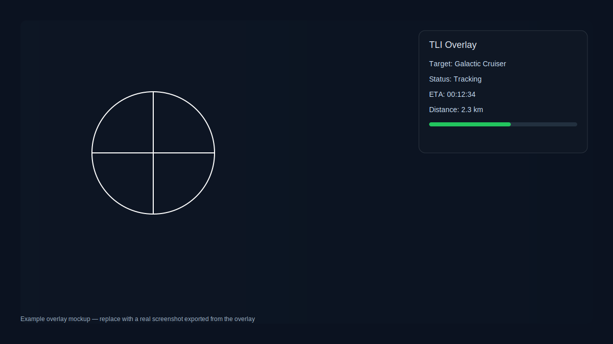
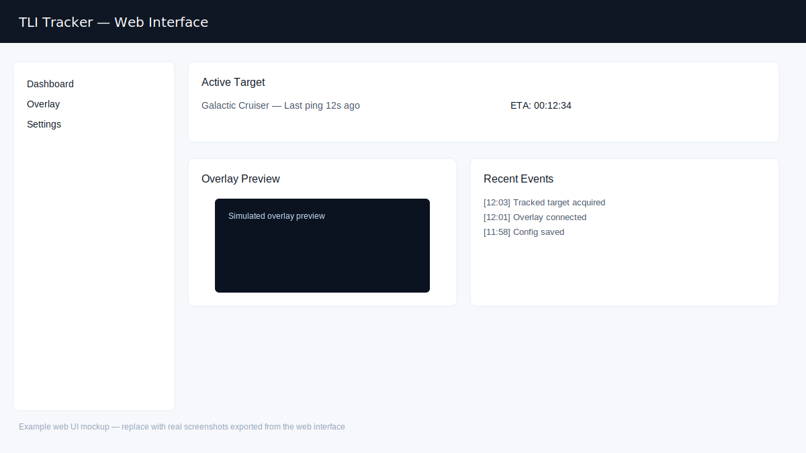

# tli-tracker (CachyOS, Rust)

CLI tracker inspired by the TLI tracker workflow: track farming sessions, drops, and profit per minute.

## Features
- Start/stop farming sessions
- Log drops with quantity and value
- Summaries with total value and profit per minute
- JSON export for analysis

## Build (CachyOS)

```bash
sudo pacman -S --needed rustup
rustup default stable
```

```bash
cargo build --release
```

Binary: `target/release/tli-tracker`

## Usage

Initialize storage:

```bash
./target/release/tli-tracker init
```

Start a session:

```bash
./target/release/tli-tracker start-session --map "Netherrealm" --notes "Test run"
```

Add drops:

```bash
./target/release/tli-tracker add-drop --name "Flame Core" --quantity 2 --value 18.5
```

End session:

```bash
./target/release/tli-tracker end-session
```

Summary:

```bash
./target/release/tli-tracker summary
```

Export:

```bash
./target/release/tli-tracker export --out ./sessions.json
```

## Webinterface + Overlay

Start the local web UI:

```bash
./target/release/tli-tracker serve --host 127.0.0.1 --port 8787
```

Open in browser:
- Dashboard: http://127.0.0.1:8787/
- Overlay: http://127.0.0.1:8787/overlay

The overlay page is designed for OBS (Browser Source) or a desktop window rule to keep it on top.

## AppImage (CachyOS)

Build a portable AppImage (x86_64):

```bash
chmod +x scripts/build-appimage.sh
./scripts/build-appimage.sh
```

Output: `TLI-Tracker.AppImage`

The AppImage launches the web UI on http://127.0.0.1:8787/ and the overlay on http://127.0.0.1:8787/overlay

## Screenshots

Example mockups showing the overlay and web interface:




See [docs/screenshots.md](docs/screenshots.md) for more information about screenshots and conversion options.

## Install on CachyOS

Quick automated installation:

```bash
curl -O https://raw.githubusercontent.com/Nwhy/tli-tracker-Rust/main/install_cachyos.sh
chmod +x install_cachyos.sh
sudo ./install_cachyos.sh
```

This will install dependencies, build the project, install the binary to `/usr/local/bin/`, and create a systemd service.

For nginx reverse proxy setup:

```bash
sudo ./install_cachyos.sh --nginx
```

See [docs/INSTALL_CACHYOS.md](docs/INSTALL_CACHYOS.md) for detailed installation instructions and troubleshooting.

## Data location

Sessions are stored at:

`~/.local/share/tli-tracker/sessions.json`
